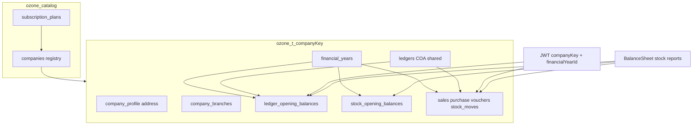

# Financial year + company/plans + openings (OzoneAI)

> Canonical architecture. One PostgreSQL database per company — **not** per financial year.
> Related requirements: [settings/financial-year.md](../requirements/v3/settings/financial-year.md), [settings/company-profile.md](../requirements/v3/settings/company-profile.md).

## Decisions (locked)

| Topic | Rule |
|-------|------|
| Tenant DB | **One PostgreSQL DB per company** — never one DB per financial year |
| FY scope | **`FinancialYearId`** on all year-bound transactions |
| Schema style | **Separate tables** (normalized, like legacy) — not fat JSON blobs |
| Company address | Own profile/address fields (and branch address table) |
| Plans | Subscription **Plans** defined in catalog; assigned to company |
| Opening balances | **Per financial year**, in dedicated tables (ledger + stock) |
| Balance sheet / stock | Always computed for **active FY**: openings + movements in that FY |

Legacy reference: `company` (address, phone, tin…), `company_branch`, `company_subcription` / `company_master.subcription`, `fin_year`, `acc_ledgers.openning_bal` (legacy stored OB on ledger — OzoneAI moves OB to **FY-keyed tables**).

## 1. Separate tables

### Catalog (`ozone_catalog`)

| Table | Purpose |
|-------|---------|
| `subscription_plans` | Plan name, limits (users, godowns, modules flags), price metadata, active |
| `companies` | Registry: key, tenant DB name, status, **PlanId**, created/last-used metrics |

Super Admin assigns a plan when creating/editing a tenant. Changing plan updates entitlements.

### Tenant DB (`ozone_t_{key}`)

| Table | Purpose |
|-------|---------|
| `company_profile` | Legal name, trade name, **address**, phone, email, GST/TIN, FSSAI, logo, bank details |
| `company_branches` | Branch name, address, phone, email, GST |
| `company_settings` | Feature flags / tax type / currency |
| `financial_years` | Name, start/end, status Open/Closing/Closed, IsDefault |
| `ledgers` (+ COA) | **Shared** across years — opening balance is **not** source of truth on ledger row |
| `ledger_opening_balances` | `(FinancialYearId, LedgerId)` → amount / DrCr |
| `stock_opening_balances` | `(FinancialYearId, ItemId, GodownId[, Batch])` → qty, rate/value |
| Txn tables | All carry `FinancialYearId` |

## 2. Company address

On `company_profile` / branches: Address, AddressLocal, Phone, Email, GSTIN/TIN, FSSAI, Logo (MinIO `{companyKey}/logo/...`). Used on invoices and balance sheet header. Catalog keeps ops fields only.

## 3. Plans

| Field | Notes |
|-------|--------|
| Name | e.g. General / Retail / Full |
| MaxUsers, MaxGodowns | Enforce in API |
| ModuleFlags | CRM, Production, POS, … |
| IsActive | |

Set at Super Admin → Create/Edit tenant. Tenant Admin may view limits only.

## 4. Financial year + opening balances

### `financial_years`

Id, Name (`2025-26`), StartDate, EndDate, Status (`Open` | `Closing` | `Closed`), IsDefault, ClosedAt, ClosedBy.

### Ledger balance in FY

`Opening(FY) + Sum(postings in FY)` via `ledger_opening_balances`.

### Stock qty in FY

`OpeningQty(FY) + In(FY) - Out(FY)` via `stock_opening_balances` + FY stock moves.

First FY: openings manual or zero; later FYs filled by year close.

## 5. Switch financial year

1. Login → default open FY → JWT includes `financial_year_id`.
2. Header switcher → `POST /v1/session/financial-year`.
3. New JWT; lists/reports filter by FY.
4. Closed FY = view-only (no posts).
5. Document date must lie in FY `[StartDate, EndDate]`.

## 6. Year close

1. Validate TB / checklist → Status `Closing`.
2. P&L → retained earnings / capital.
3. Create/activate next `financial_years`.
4. Write next FY `ledger_opening_balances` + `stock_opening_balances`.
5. Old FY `Closed`; new `Open` + default.
6. Hangfire for large tenants. **Same database** — no new DB.

## 7. Balance sheet

1. Header from `company_profile` (name + address).
2. Assets / Liabilities from COA; each line = Opening(FY) + movements(FY).
3. Inventory from stock openings + FY moves (default valuation: weighted from openings+moves).
4. Never mix another FY’s postings unless explicit multi-year admin report.

## 8. What carries FinancialYearId

**Yes:** sales, purchase, vouchers, stock journal/physical, ledger postings, notes, POS, cheque.  
**No:** items, parties, COA structure, godowns, users, menus.  
**FY tables:** `ledger_opening_balances`, `stock_opening_balances`.

## 9. Implementation sequence

Docs → Catalog Plans → Create tenant + profile → Auth JWT → FY switch → Opening tables → Txns with FY → Balance sheet → Year close → Legacy import map.

## 10. Acceptance criteria

- Company address editable; prints on BS/invoices.
- Plan selectable on tenant create; limits enforced.
- Multiple FYs in one company DB; switch changes session only.
- Opening balances stored **per FY** in separate tables.
- Stock qty/value for FY = openings + FY movements.
- Balance sheet for FY uses openings + that FY’s activity only.
- Year close populates next FY openings without creating a new DB.
