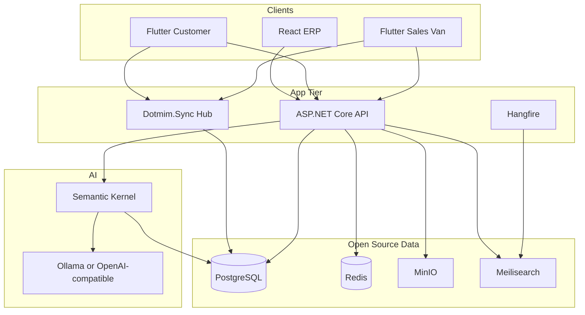
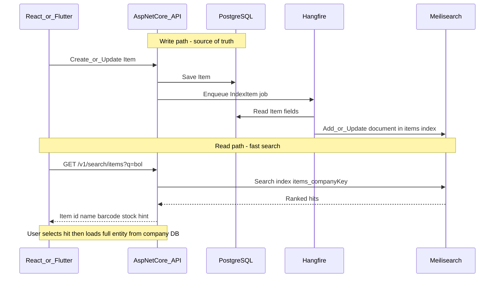
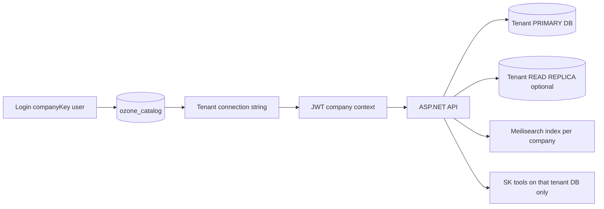
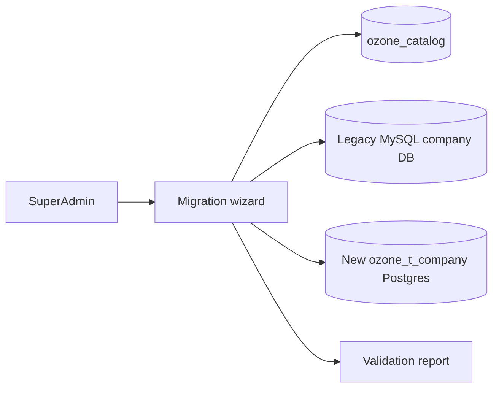
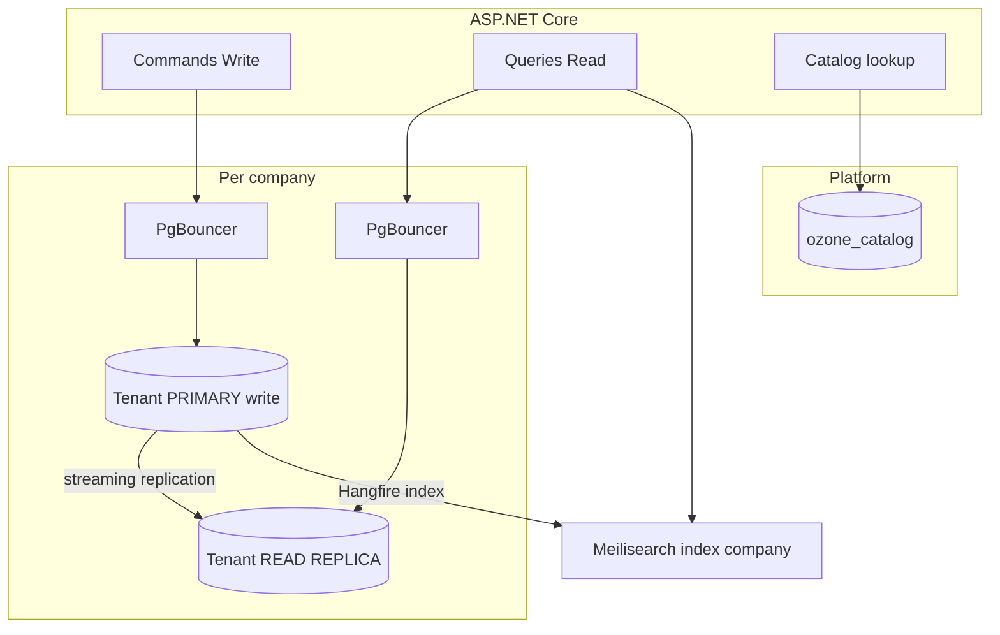
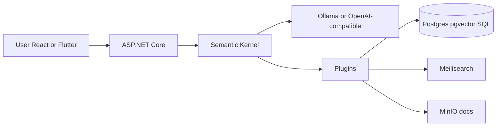
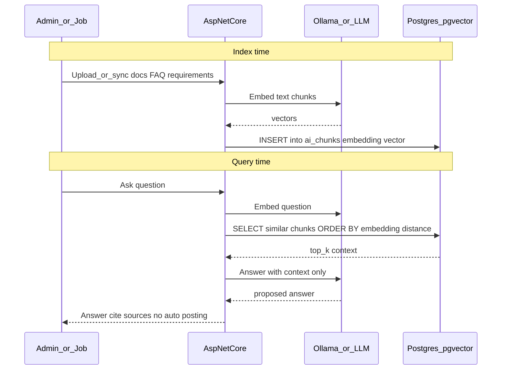
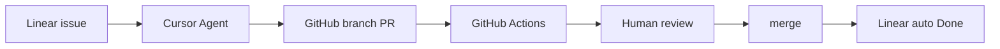

# AI-Integrated ERP — Architecture & Tech Stack

> Living architecture doc for the new open-source, self-hosted ERP.
> Source requirements: [docs/requirements/v3/](../requirements/v3/)
> Last synced from product planning session.
# AI-Integrated ERP — Tech Stack (Open Source / Self-Hosted)

## Design goals

- Rebuild from [`docs/requirements/v3/`](docs/requirements/v3/)
- AI-integrated ERP + Customer / Sales / Van mobile apps + offline
- **Open source / self-hosted — no Azure cloud dependency**
- .NET architect owns API/domain

## Committed stack

| Layer | Choice | Why |
|-------|--------|-----|
| Backend API | **ASP.NET Core 9** | Domain, OpenAPI, auth, jobs |
| ORM | **EF Core 9** + Dapper | CRUD + heavy reports |
| CQRS | **MediatR** + FluentValidation | Posting pipelines |
| Web ERP UI | **React + TS (Vite)** + AG Grid + **Ant Design** | ERP grids/forms |
| Mobile | **Flutter** (customer / sales / van) | Offline field apps |
| Primary DB | **PostgreSQL 16** | Open source; strong ERP fit; RLS |
| Cache / jobs | **Redis** + **Hangfire** | Queues, PDF, sync, AI jobs |
| Offline sync | **Dotmim.Sync** (Postgres ↔ SQLite) + idempotent commands | Van/sales offline |
| Object storage | **MinIO** (S3 API) | Bills, images, files |
| Auth | **ASP.NET Core Identity** + JWT/refresh + device binding | Multi-role |
| Search (keyword/typo) | **Meilisearch** (self-hosted Docker) | Fast typeahead for item/customer codes & names |
| Vector DB (semantic/AI) | **pgvector** on PostgreSQL (same DB) | Embeddings for RAG / “similar meaning” search; no extra paid vector cloud |
| AI | **Semantic Kernel** + **Ollama** or OpenAI-compatible API | Embeddings + chat; fully self-hostable with Ollama |
| Reports | **QuestPDF** | PDF templates |
| Observability | **OpenTelemetry** + **Seq** or **Grafana/Loki** | Self-hosted traces/logs |
| Deploy | **Docker Compose** (Linux VPS / on-prem) | Fully self-hosted |



## What is Meilisearch?

**Meilisearch** is an **open-source search engine** (not your ERP database).

- Purpose: instant, typo-tolerant search (“typeahead”) for items, customers, invoices, etc.
- PostgreSQL remains the **system of record**; Meilisearch holds a **search index** (copy of searchable fields).
- Self-host with Docker; MIT-licensed; simple HTTP API.
- Better UX than `LIKE '%x%'` on large item/customer tables (POS, van sales, React lookups).

It is **not** a replacement for SQL, stock posting, or ledgers.

### Cost: Cloud vs Docker (self-host)

| Option | Cost |
|--------|------|
| **Meilisearch Cloud** (their SaaS) | Paid subscription — **we do not use this** |
| **Self-host with Docker** | **Free software** (MIT). You only pay for the machine (VPS/on-prem) CPU/RAM/disk |

For ERP item/customer search, a small instance is enough (often **512MB–1GB RAM** to start; scale with catalog size).

### Host Meilisearch in Docker

Add to the same `docker-compose.yml` as Postgres/Redis/MinIO:

```yaml
services:
  meilisearch:
    image: getmeili/meilisearch:v1.11
    container_name: ozone-meilisearch
    restart: unless-stopped
    ports:
      - "7700:7700"   # bind to localhost only in production (see below)
    environment:
      MEILI_ENV: production
      MEILI_MASTER_KEY: "change-me-to-a-long-random-secret"
      MEILI_NO_ANALYTICS: "true"
    volumes:
      - meili_data:/meili_data
    # Optional resource limits
    mem_limit: 1g

volumes:
  meili_data:
```

**Run:**

```bash
docker compose up -d meilisearch
curl http://127.0.0.1:7700/health
```

**Production hardening:**
- Do **not** expose port `7700` publicly; only the ASP.NET Core API talks to Meilisearch on the Docker network (`http://meilisearch:7700`).
- Set a strong `MEILI_MASTER_KEY`; API uses it server-side only (never in React/Flutter).
- Persist `meili_data` volume; backup volume with your normal backup job.
- Reindex from PostgreSQL after restore (Hangfire full-reindex job).

**ASP.NET Core config (example):**

```json
{
  "Meilisearch": {
    "Url": "http://meilisearch:7700",
    "ApiKey": "change-me-to-a-long-random-secret"
  }
}
```

If even 1GB RAM is tight on a small VPS: skip Meilisearch initially and use PostgreSQL `pg_trgm` for search; add Meilisearch later when catalogs grow.

## Meilisearch flow (how it works in this ERP)



### Write / index path
1. User saves Item / Customer / etc. → **that company’s PostgreSQL** commit.
2. Hangfire job upserts into Meilisearch index **`items_{companyKey}`** (`id`, `name`, `barcode`, `sku`, `brand`).
3. Deletes / deactivate → remove document from that company index.

### Search path (typeahead)
1. UI calls `GET /v1/search/items?q=bolt` (JWT carries `companyKey`).
2. API searches only `items_{companyKey}` (hard isolation — other companies’ indexes never queried).
3. Selecting a hit loads full detail from **that company’s** PostgreSQL.

### Offline note
- **Online:** React/Flutter use Meilisearch via API.
- **Offline (van/sales):** search local **SQLite** (synced masters); Meilisearch is server-side only.

### Indexes (initial)
- `items` — name, barcode, sku, category, brand  
- `customers` — name, phone, code, area  
- `suppliers` — name, phone, code  
- Later: `invoices` (invoice no + customer) if needed for global search  

## Multi-tenant architecture (committed): **one database per company**

Same isolation model as legacy Ozone / CPZSAS: **each company gets its own PostgreSQL database**. App binaries and platform services are shared; business data is never mixed in one schema.

### Model: catalog DB + tenant DBs

| Database | Purpose |
|----------|---------|
| **`ozone_catalog` (central)** | Companies, company key, tenant DB connection info, subscriptions, platform SuperAdmin |
| **`ozone_t_{companyKey}` (per company)** | Full ERP data: users, items, sales, stock, ledgers, CRM, etc. |
| Optional **read replica** of a tenant DB | For large companies only — reports/AI off the write DB |

Login: **company key + user + password** → lookup catalog → open **that company’s DB** → JWT carries `company_id`, `company_key`, **`financial_year_id`**, connection name (or opaque tenant handle), roles.



### Financial year (committed): dimension in tenant DB — **not** a new database

Full design: [financial-year.md](financial-year.md).

| Rule | Detail |
|------|--------|
| Scope key | `FinancialYearId` on all year-bound transactions |
| Openings | Separate `ledger_opening_balances` + `stock_opening_balances` per FY |
| Switch | Session/JWT only — no DB provision |
| Year close | Writes next FY openings in the **same** company DB |
| Company address / plans | Tenant `company_profile`; catalog `subscription_plans` → `companies.PlanId` |

### Isolation rules (non-negotiable)

1. After login, **all** business EF/SQL uses the **tenant connection** — never the catalog for sales/stock.
2. Catalog stores host, database name, credentials (encrypted at rest); rotate via SuperAdmin.
3. Meilisearch: **separate index per company** (e.g. `items_{companyKey}`) or single index with mandatory `companyKey` filter — prefer **index-per-company** for hard isolation.
4. MinIO prefix: `{companyKey}/...`.
5. Offline sync device bound to one `companyKey` / one tenant DB.
6. AI tools open only the current tenant DB; no cross-company SQL.
7. Hangfire job payload includes `companyKey`; worker resolves connection from catalog before work.
8. Redis keys: `c:{companyKey}:...`.
9. Provisioning: create company → create DB from migrations/template → register in catalog → seed admin user.

### Shared vs per-company

| Shared platform | Per-company |
|-----------------|-------------|
| ASP.NET / React / Flutter apps | Entire ERP schema + data |
| Catalog DB | Tenant PRIMARY (+ optional REPLICA) |
| Meilisearch / Redis / MinIO / Ollama processes | Indexes, cache, blobs, AI chunks for that company |
| Hangfire server | Jobs scoped by companyKey |

### .NET tenant context

- `ITenantConnectionFactory` / `ICompanyDb` resolves Npgsql connection from JWT → catalog cache.
- `WriteDbContext` / `ReadDbContext` are created **for that company DB** (same schema, different database).
- No `TenantId` column required on business tables (isolation = database boundary). Keep `CompanyId` only if useful for audits.
- Connection pooling: **PgBouncer** (or Npgsql multiplexing) carefully — pools keyed by database name; avoid leaking connections across companies.
- Cache catalog lookup in memory/Redis with short TTL.

### Provisioning flow (create one tenant)

1. Super Admin opens **Tenants** → **Create tenant**.
2. Enters company name, `companyKey`, admin email/user, plan/limits.
3. API creates DB `ozone_t_{key}`, runs EF migrations, seeds defaults + first Admin user.
4. Catalog row saved: connection (encrypted), status=`Active`, `CreatedAt`, `LastUsedAt=null`, counters=0.
5. Optional: start **Migrate from legacy** wizard (see below) or leave empty for greenfield.
6. Tenant appears in Super Admin list; company can log in with company key.

## Super Admin features (platform console)

React area: `/super-admin/*` (role `SuperAdmin` only; uses **catalog DB**, not a tenant DB).

### Tenant list (home)

| Column / metric | Source | Notes |
|-----------------|--------|-------|
| Company name / key | catalog | |
| Status | Active / Suspended / Migrating / Failed | |
| Created date | catalog | |
| **Last used date** | catalog `LastUsedAt` | Updated on any successful tenant API login or heartbeat |
| **Active users** | catalog cache or nightly job | Count of users with login in last N days (default 30) inside tenant DB |
| Total users | tenant DB query (cached) | |
| DB size / host | Postgres stats + catalog | |
| App version / migration version | catalog | |
| Legacy migration status | NotStarted / InProgress / Done / Error | |

Actions per row: Open (impersonate audit), Suspend/Activate, Reset admin password, View health, **Migrate legacy**, Delete (dangerous, confirm).

### Create tenant

Form fields: name, companyKey (unique), admin user, password, timezone, currency/tax defaults, optional “empty vs migrate”.

### Tenant detail dashboard

- Last used date/time + last used by (user)
- Active users (7/30/90 day toggles)
- Login chart (from catalog `tenant_login_daily` rollup)
- Sync devices count, last sync
- Storage (MinIO prefix size), Meilisearch index health
- Errors: last failed jobs, migration log

### How metrics are collected (easy, not heavy)

| Metric | Mechanism |
|--------|-----------|
| **Last used** | Middleware: on authenticated tenant request, throttle-update catalog `LastUsedAt` (e.g. at most once per 5 minutes per company) |
| **Active users** | Hangfire nightly: for each tenant DB, `COUNT(DISTINCT user_id) WHERE LastLoginAt >= now()-30d` → write `ActiveUsers30d` on catalog |
| **Total users** | Same job: `COUNT(*)` from tenant `users` |

Catalog never stores business documents — only **ops metadata**.

### Other Super Admin capabilities (v1)

- Platform user management (other Super Admins)
- Impersonate tenant Admin (full audit log: who/when/why)
- Feature flags per tenant (AI on/off, van module, etc.)
- Connection string rotate / move tenant to another Postgres host
- Broadcast maintenance message

## Easy migration: current (legacy) DB → new tenant DB

Goal: **one-company-at-a-time**, guided, restartable migration from legacy **MySQL** Ozone DB into new **PostgreSQL** `ozone_t_{key}` — without big-bang cutover for all customers.

### Principles

- Migrate **one tenant = one legacy company DB** → one new Postgres DB.
- **Idempotent** steps (re-run safe); progress saved in catalog `migration_runs` / `migration_steps`.
- Preserve business numbers (invoices, ledgers) via mapping tables (`legacy_id` → `new_id`).
- Dry-run + validation report before go-live.
- Old MySQL kept read-only during pilot; cutover flips company key to new stack.



### Scope commitment: **all transaction records**

Default migration copies **every** transactional document and posting for that company — not a sample and not “masters only”.

| Category | Legacy → new (all rows) |
|----------|-------------------------|
| Sales family | sales, sales_return, estimate/order, delivery_note, quotation + **all line items** |
| Purchase family | purchase, purchase_return, purchase order + **all lines** (+ IMEI/serials if present) |
| Vouchers | payment, receipt, journal, contra + **voucher_trans** |
| Credit / debit notes | credit_note, debit_note (+ lines) |
| Stock movements | godown transfer, stock journal, damage, physical stock, item ledger / godown stock posts |
| Accounting posts | **acc_ledger_trans**, **acc_ageing**, **acc_ageing_trans** (full history) |
| Linked ops | POS sales, replacement vouchers, cheque register entries tied to vouchers |
| Optional modules | CRM payments, clinic payments, etc. if that company used them |

**Default date range = all history** (from first transaction to latest).  
Optional “from date” filter is opt-in only (Super Admin must explicitly choose) — not the default.

Cancelled/soft-deleted (`published=no`) rows are migrated too, with the same status flags, so registers and audits match legacy.

### Choose what to sync / migrate (Super Admin checklist)

Before execute, Super Admin **selects which packages** to pull from legacy into the new company DB. Discovery shows row counts per package so they can decide.

| Package ID | Package | Default | Includes |
|------------|---------|---------|----------|
| `masters` | Masters | ON | units, tax, HSN, godown, category, brand, bill types, areas, routes |
| `parties` | Customers / suppliers | ON | parties + linked ledgers |
| `items` | Items & stock baseline | ON | items, barcodes, opening/godown stock |
| `txn_sales` | Sales transactions | ON | all sales types + lines |
| `txn_purchase` | Purchase transactions | ON | all purchase types + lines |
| `txn_vouchers` | Vouchers | ON | payment/receipt/journal/contra + lines |
| `txn_stock` | Stock documents | ON | journal, transfer, damage, physical |
| `txn_ledger` | Ledger & ageing posts | ON | acc_ledger_trans, ageing (+ trans) |
| `txn_notes` | Credit / debit notes | ON | headers + lines |
| `users` | Users & permissions | ON | users, menu grants (passwords reset policy) |
| `crm` | CRM | OFF unless detected | leads, enquiries, follow-ups |
| `pos` | POS extras | ON if sales POS present | counters / POS-only fields |
| `vertical_*` | Clinic / education / hotel / … | OFF unless module used | vertical tables |

**Rules:**
- UI is a checklist with **Select all transactions** / **Select all masters** shortcuts.
- Dependencies enforced: e.g. `txn_sales` requires `parties` + `items` + `masters`; `txn_ledger` requires parties/ledgers.
- If Super Admin turns OFF a transaction package, wizard warns: reports/balances may not match legacy.
- Recommended production cutover: **all `txn_*` ON** (full history).
- Choice saved on `migration_runs.selected_packages` (JSON) for audit/resume.

Same idea later for **device offline sync** (Sales/Van): admin picks scopes (`masters`, `customers`, `items`, `open_invoices`, `van_stock`) per role/device — not the whole company DB.

### Wizard steps (Super Admin UI)

1. **Select / create tenant** in catalog (or attach migration to existing empty tenant).
2. **Connect legacy**: host, database, user, password (stored encrypted, used only for migration).
3. **Discover**: row counts + min/max dates for every transaction table (sales, purchase, vouchers, ledger_trans, …).
4. **Choose packages to sync** (checklist above) + map options: timezone, default godown; date filter **off by default**. Show estimated volume/time for selected packages only.
5. **Dry-run**: small batch + validators; show errors/warnings (does not skip full load).
6. **Execute** only **selected packages** (Hangfire — progress % per package and date batch):
   - Run in dependency order; skip unchecked packages
   - For each selected `txn_*`: date-batched full history load
7. **Validate** against **selected packages only** (full counts/totals for those packages):
   - Row counts legacy vs new
   - Money totals where txn packages selected
   - Stock/ageing checks if those packages selected
   - Orphan FKs = 0 within migrated set
8. **Cutover**: tenant `Active`, `LegacyMigrationStatus=Done`, point company key to new stack.
9. **Post**: rebuild Meilisearch for company; optional AI doc seed.

### Technical approach (easy for team)

| Piece | Approach |
|-------|----------|
| Extract | MySqlConnector read-only from legacy |
| Transform | C# mappers per entity (aligned to [`docs/requirements/v3`](docs/requirements/v3)) |
| Load | Bulk copy / batched inserts into tenant Postgres (preserve invoice numbers & dates) |
| Orchestration | Hangfire per phase; checkpoint by `date` + `legacy_id` so full history can resume |
| Mapping | `migration_id_map (entity, legacy_id, new_id)` for lines/refs |
| Integrity | Re-link `sales_ref_id`, `order_id`, estimate→sale, receipt→ageing using the map |
| Passwords | Do not copy plaintext; must-reset or migrate hashes if known |

### What makes migration “easy”

- Per-company wizard (not custom scripts per client each time)
- Resume after failure from last checkpoint (critical for large transaction history)
- Validation report: **full counts + money totals** (plus spot-check invoices)
- Pilot one tenant first, then repeat for others
- Keep legacy DB until validation signed off

### Out of scope for v1 migrator

- Merging two companies into one DB
- Live dual-write forever (optional later)
- Dead/orphan legacy tables with no new-module equivalent (documented skip list — **not** used to drop real sales/purchase/voucher/ledger history)

### Multi-tenant + large data / write speed

- Each company’s write load is isolated (noisy neighbor less severe than shared tables).
- Large company: add **dedicated READ REPLICA** for that tenant DB only.
- Very large company: dedicated Postgres instance/host registered in catalog.
- Partition big tables **inside** the company DB by month (sales, ledger lines).
- Per-company API/AI rate limits still apply.

## Data architecture: Write DB vs Read DB (per company, large datasets)

Goal: **fast writes** inside each company DB; reports/AI do not block OLTP.

### Structure we follow



| Store | Role | Used for |
|-------|------|----------|
| **Catalog DB** | Platform registry only | Company keys, tenant connection strings, subscriptions |
| **Tenant PRIMARY (Write DB)** | That company’s source of truth | Sales, stock, vouchers, sync intake |
| **Tenant READ REPLICA** | Optional copy of that company | Reports, dashboards, AI ask-your-data |
| **Meilisearch** | Search index per company | Typeahead |
| **Redis / MinIO** | Shared infra, keyed by company | Cache, files |

**Rule in code:**  
- `IWriteDb` / `WriteDbContext` → **PRIMARY only**  
- `IReadDb` / `ReadDbContext` → **REPLICA** (fallback to primary only if replica lag/unavailable and query is critical)  
- Never run heavy reports or unrestricted AI SQL on PRIMARY.

### How write speed stays high

1. **Offload reads** — Trial balance, stock registers, dashboards hit **replica**; primary stays free for OLTP.
2. **CQRS-style application split** — Commands (post sale) vs Queries (list/report); same Postgres family, different connections.
3. **PgBouncer** in front of primary and replica — pool connections under Flutter/van burst traffic.
4. **Narrow write transactions** — post sale = short unit-of-work; no report generation inside the same transaction.
5. **Async side effects** — Meilisearch index, PDF, WhatsApp, embeddings via **Hangfire** after commit (outbox table on primary).
6. **Partition large tables** inside the company DB — e.g. `sales`, `acc_ledger_trans`, `item_ledger` by **month**; keeps indexes and vacuums manageable.
7. **Indexes disciplined on write path** — only indexes required for posting/unique invoice; reporting indexes prefer **replica** or BRIN on date columns.
8. **Bulk APIs** — van/mobile sync uses batched inserts/`COPY`-style bulk where safe; idempotent `ClientRequestId`.
9. **Per-company DB** — no cross-tenant `tenant_id` filter on business tables; index by date/invoice/customer inside that DB.

### Read models (optional second stage)

When replica reports are still slow **for that company**:

- **Materialized views** on that tenant’s replica for Trial Balance / stock summary  
- Or Hangfire projections inside the company DB (`report_daily_sales`, etc.)  
Financial truth stays on that company’s PRIMARY.

### Lag and consistency

- After a write, show that bill from **tenant PRIMARY** (read-your-writes).
- Lists/reports: **tenant REPLICA** when configured; else PRIMARY.
- Monitor replication lag per company that has a replica.

### Docker / deploy sketch

```yaml
services:
  postgres-catalog:     # ozone_catalog only
  postgres-tenants:     # hosts many DBs ozone_t_* (or multiple Postgres hosts)
  # large tenants: dedicated postgres + replica registered in catalog
  pgbouncer:
  meilisearch:
  redis:
  minio:
  api:
  hangfire:
```

Connection resolution in API:

- `ConnectionStrings:Catalog` → catalog DB (fixed)  
- After login: catalog → `Write` / `Read` connection for `ozone_t_{companyKey}` (dynamic, cached)

### What we do not do for “faster writes”

- Put all companies in one shared business schema  
- Use Meilisearch/Mongo as write DB for invoices  
- Run AI full-table scans on a tenant PRIMARY during peak OLTP  
- Share one DbContext connection across two companies in the same request  

## Offline (unchanged concept)

Dotmim.Sync: **that company’s** Postgres ↔ device SQLite scopes (`masters`, `documents`, `van_stock`) + idempotent `/v1/sync/commands`.

## AI plan: Semantic Kernel + Ollama / OpenAI-compatible

### Roles (who does what)

| Piece | Role |
|-------|------|
| **ASP.NET Core API** | Entry point: `/v1/ai/*`. Auth, tenant, rate limits. Never lets the model post sales/stock directly. |
| **Semantic Kernel (SK)** | .NET orchestration library inside the API (or `OzoneErp.Ai` project). Builds prompts, calls LLM, runs **plugins/tools** (search, SQL read, RAG). |
| **Ollama** *or* **OpenAI-compatible API** | The **LLM brain** only (chat + embeddings). Swappable via config — SK does not care which one. |
| **pgvector** | Stores embeddings for RAG |
| **Meilisearch** | Keyword lookup tool the SK plugin can call |
| **Hangfire** | Long jobs: reindex embeddings, nightly forecast |



### How we plan to run it (default = private)

**Default (self-hosted, private data):**
1. Run **Ollama** in Docker on your server (or a GPU box on LAN).
2. Pull models e.g. `llama3.2` (chat) + `nomic-embed-text` (embeddings).
3. ASP.NET config points SK at Ollama’s OpenAI-compatible endpoint: `http://ollama:11434/v1`.
4. All prompts/data stay on your network.

**Alternate (cloud LLM, still no Azure):**
1. Use any **OpenAI-compatible** HTTP API (OpenAI, Groq, Together, local vLLM, LiteLLM gateway, etc.).
2. Same SK code — only change `BaseUrl` + `ApiKey` in config.
3. Use when you want stronger models without owning a GPU.

**Config switch (same codebase):**

```json
{
  "Ai": {
    "Provider": "Ollama",
    "BaseUrl": "http://ollama:11434/v1",
    "ApiKey": "ollama",
    "ChatModel": "llama3.2",
    "EmbeddingModel": "nomic-embed-text"
  }
}
```

Or `"Provider": "OpenAICompatible"` with vendor BaseUrl/ApiKey/models — **no code fork**.

### Request flow (example: “Ask ERP / Help”)

1. User sends question + JWT (tenant) to `POST /v1/ai/ask`.
2. API creates an SK **chat** with tenant system prompt (“you propose only; never invent stock numbers without a tool”).
3. SK may call plugins:
   - `SearchDocs` → pgvector similarity on FAQ/requirements
   - `FindItem` → Meilisearch
   - `RunSafeQuery` → allow-listed read-only SQL views (balances, etc.)
4. SK sends tool results + question to **Ollama / OpenAI-compatible** model.
5. API returns answer + citations. If user accepts a **draft** (e.g. draft PO), a normal ERP command API posts it — not the LLM.

### Safety rules (fixed)

- LLM **cannot** call `PostSale` / `PostVoucher` tools in v1 (or those tools only create **drafts** awaiting confirm).
- Every tool is tenant-scoped from JWT.
- Token/quota per tenant; log prompts/responses for audit (MinIO or DB).
- Financial numbers must come from SQL tools, not model memory.

### Feature phases (implementation order)

See full product list in **AI features backlog** below. Phases A→E map to that backlog.

### Docker sketch (AI pieces)

```yaml
services:
  ollama:
    image: ollama/ollama:latest
    volumes:
      - ollama_data:/root/.ollama
    # GPU: deploy.resources.reservations.devices if available
  # api already depends on postgres with pgvector
```

Pull models once: `docker exec -it ollama ollama pull llama3.2` and `nomic-embed-text`.

### What we are *not* planning

- Azure OpenAI as a dependency
- Separate Python LangChain service for v1 (SK stays in .NET)
- LLM writing straight to `sales` / `voucher` tables

## AI features backlog (product list)

All features are **assistive**: propose / draft / explain. User or API confirm before stock/ledger changes.

### P0 — Must have (first AI release)

| ID | Feature | Who uses it | What it does |
|----|---------|-------------|--------------|
| AI-01 | **Smart typeahead** | Admin, Sales, Van | Meilisearch (+ optional SK ranking) for item/customer by name, barcode, phone, typo-tolerant |
| AI-02 | **Ask your data (NL Q&A)** | Admin, Manager | Natural language → allow-listed read-only SQL/views (“top debtors this month”, “stock of X in van”) with cited numbers |
| AI-03 | **In-app Help / SOP bot** | All staff | RAG over requirements docs + tenant FAQ/SOPs (pgvector); answers “how do I…” with steps |
| AI-04 | **Draft from OCR** | Purchase / Admin | Photo/PDF of supplier invoice → **draft purchase** (lines, tax, totals) for review & save |
| AI-05 | **Anomaly alerts (basic)** | Admin | Flag unusual discount, credit limit breach, big return, duplicate bill patterns (rules + light ML/SK summary) |

### P1 — Field force & commerce (after offline core)

| ID | Feature | Who uses it | What it does |
|----|---------|-------------|--------------|
| AI-06 | **Sales copilot** | Sales person | Next-visit suggestions, open follow-ups, ageing hints, suggested order from history |
| AI-07 | **Van load advisor** | Van sales | Suggested load from route + sales history + current van stock (draft transfer) |
| AI-08 | **Collection assistant** | Sales / Van | Prioritize whom to collect; draft receipt narration; payment reminder text (SMS/WhatsApp template) |
| AI-09 | **Customer app assistant** | B2B Customer | “Reorder last bill”, FAQ, order status in plain language |
| AI-10 | **Credit risk hint** | Sales, Admin | Soft warning before credit sale (overdue, limit, bounce history) — block still by rules, AI explains |

### P2 — Planning & documents

| ID | Feature | Who uses it | What it does |
|----|---------|-------------|--------------|
| AI-11 | **Demand / reorder forecast** | Inventory | Suggest reorder qty/date per item/godown; exportable suggestion list |
| AI-12 | **Similar item / substitute** | Sales, Van | If OOS, suggest alternatives from description/category embeddings |
| AI-13 | **Report narrator** | Manager | Selected report/KPI → short plain-language summary + bullet insights |
| AI-14 | **Email/PO draft writer** | Purchase | Draft PO email / terms from cart (user edits before send) |
| AI-15 | **Price / margin coach** | Sales, Admin | Warn low margin / below min price; suggest target price band |

### P3 — Later / optional verticals

| ID | Feature | Who uses it | What it does |
|----|---------|-------------|--------------|
| AI-16 | **Voice note → enquiry/order draft** | Sales | Speech-to-text → draft CRM enquiry or sales order |
| AI-17 | **Image → item match** | Van / Warehouse | Photo of product/label → candidate items |
| AI-18 | **Churn / inactive customer** | CRM | Customers with falling frequency; suggested win-back action |
| AI-19 | **Clinic/education/hotel copilots** | Vertical modules | Domain FAQs + booking/fee assistants (only if vertical sold) |

### Explicitly out of AI scope (v1)

- Auto-posting sales, receipts, stock journals without user confirm  
- Fully autonomous pricing changes  
- Replacing GST/e-invoice legal filing with AI guesses  
- Training on other tenants’ data (strict tenant isolation)

### Mapping to SK phases

| Phase | Feature IDs |
|-------|-------------|
| A | AI-01, AI-02 |
| B | AI-11, AI-13 |
| C | AI-04 |
| D | AI-06, AI-07, AI-08, AI-10 |
| E | AI-03 |
| After core | AI-05, AI-09, AI-12, AI-14, AI-15, then P3 |

## Vector DB — what it is and when we use it

A **vector database** stores **embeddings** (numeric fingerprints of text/images) so the AI can find things by **meaning**, not exact keywords.

| Tool | Job |
|------|-----|
| **PostgreSQL** | Business truth (sales, stock, ledgers) |
| **Meilisearch** | Fast **keyword / typo** search (“bolts”, barcode `8901…`) |
| **pgvector** | **Semantic** search / RAG (“how do I cancel a credit sale?”, similar items by description) |

You do **not** need a separate paid vector cloud (Pinecone, etc.).

### Committed choice: **pgvector** (open source, inside PostgreSQL)

- Extension on the same Postgres you already run
- Docker: use image `pgvector/pgvector:pg16` (or enable extension on your Postgres)
- Cheap ops: one database to backup; no extra cluster for v1
- Good for: help-bot RAG, FAQ, requirements docs, optional “similar item” suggestions

**Optional later:** dedicated **Qdrant** (Docker) only if embedding volume becomes huge (millions of chunks). Not required at start.

### Vector / RAG flow



### What gets embedded (phased)

| Phase | Content | Table (example) |
|-------|---------|-----------------|
| E | Help: `docs/requirements/v3`, tenant FAQ, SOPs | `ai_chunks` |
| A/D | Optional: item descriptions for “similar products” | `item_embeddings` |
| — | Do **not** embed full ledger lines as default | Keep financial queries as SQL tools, not vectors |

### Meilisearch vs pgvector (both stay)

- Typeahead in sales form → **Meilisearch**
- “Ask the ERP / help” → **pgvector** + LLM
- Stock balance / trial balance → **SQL** (not vectors)

## What we do not use

- Azure App Service / Azure SQL / Blob / AI Search / Document Intelligence / App Insights  
- Paid vector clouds (Pinecone, Weaviate Cloud, etc.) for v1 — use **pgvector**  
- Angular / Blazor as primary admin UI  
- Meilisearch as system of record or as the only vector store  

## Delivery phases

1. Docker Compose: catalog Postgres + tenant Postgres host, Redis, MinIO, Meilisearch, API, React  
2. **Super Admin**: create tenant, tenant list (last used, active users), health  
3. Core ERP Wave 1 on a greenfield tenant  
4. **Legacy migration wizard** (one company MySQL → Postgres); pilot one tenant  
5. Flutter Sales/Van + sync  
6. Customer app  
7. AI phases on SK + Ollama/OpenAI-compatible

---

## Document control

- Path: `docs/architecture/tech-stack.md`
- Related: [requirements pack](../requirements/v3/README.md)


## Development automation: Linear + Cursor + GitHub (committed workflow)

Goal: **Linear** owns work tracking, **Cursor** owns implementation, **GitHub** owns code/PRs/CI. One issue → one branch → one PR → done.



### Tool roles

| Tool | Role |
|------|------|
| **Linear** | Backlog, sprint/cycle, priorities, status, acceptance notes; link to requirements paths |
| **Cursor** | Implement from Linear issue + `docs/requirements/v3/...` + `docs/architecture/tech-stack.md` |
| **GitHub** | Repo, branches, PRs, Actions CI, code review |

### Linear setup (project)

- **Teams:** Platform (Super Admin, catalog, migration), ERP Core (masters/sales/purchase/vouchers), Field (Flutter Sales/Van), Customer App, AI  
- **Labels:** `feat`, `fix`, `chore`, `migration`, `ai`, `spike`  
- **Priority:** P0/P1/P2 matching requirements  
- **Issue template fields:**  
  - Spec path (e.g. `docs/requirements/v3/transaction/sales.md`)  
  - Acceptance criteria (checklist)  
  - Out of scope  
- **Cycles:** 1–2 week; pull from backlog ordered by delivery phases  

### Linear ↔ GitHub link

- Connect Linear GitHub integration (official).  
- Branch name from issue: `feat/OZC-123-post-credit-sale` (Linear ID in branch).  
- PR title/body include `OZC-123` so Linear auto-moves: In Progress → In Review → Done on merge.  
- Prefer **one Linear issue = one PR**.

### Cursor ↔ Linear

- Paste Linear issue ID + URL + spec path into the Agent prompt.  
- Agent implements only that issue’s acceptance criteria.  
- Optional: Linear MCP in Cursor (if configured) to read issue description/comments without copy-paste.  
- Do not expand scope into other issues without a new Linear ticket.

### Repo layout (monorepo)

```
/
  docs/requirements/v3/      # screen specs (source of truth for features)
  docs/architecture/         # tech-stack.md (this plan)
  src/                       # ASP.NET Core solution
  apps/ozone_web/            # React admin
  apps/ozone_mobile/         # Flutter
  .cursor/rules/             # agent coding rules
  .github/workflows/         # CI
```

### Branch model

| Branch | Purpose |
|--------|---------|
| `main` | Always deployable; protected |
| `develop` | Integration branch |
| `feat/*` | One feature from a requirements doc or arch slice |
| `fix/*` | Bugfixes |
| `chore/*` | tooling, CI, docs-only |

**Cursor rule:** never commit straight to `main`. One PR per feature slice.

### End-to-end loop (per Linear issue)

```mermaid
flowchart LR
  Spec[docs requirements] --> Issue[Linear issue OZC-123]
  Issue --> Agent[Cursor Agent implement]
  Agent --> Local[build test locally]
  Local --> Commit[git commit conventional]
  Commit --> Push[push feat/OZC-123-...]
  Push --> PR[gh pr create links OZC-123]
  PR --> CI[GitHub Actions]
  CI --> Review[Human review]
  Review --> Merge[merge to develop]
  Merge --> Done[Linear status Done]
```



1. Create/refine Linear issue (spec path + acceptance criteria).  
2. Move issue to **In Progress**; start Cursor Agent with issue ID + spec path + “follow `docs/architecture/tech-stack.md`”.  
3. Agent implements + tests.  
4. Commit: `feat(sales): post credit sale with ageing (OZC-123)`.  
5. Push branch `feat/OZC-123-...` + `gh pr create` (mentions `OZC-123`).  
6. CI green → human review → merge.  
7. Linear marks **Done** via GitHub integration.

### What we automate in Cursor

| Area | Automation |
|------|------------|
| Feature build | Agent implements from markdown requirements |
| Refactors | Agent + tests green |
| Docs sync | Update requirements/architecture when behavior changes |
| PR text | Agent drafts PR body from diff |
| Migrations | Agent adds EF migrations; human reviews destructive ones |
| Code review assist | Bugbot / security-review subagents on request |

### Git safety (non-negotiable)

- No force-push to `main` / `develop`
- No commit of secrets (`.env`, connection strings) — use User Secrets / env samples
- Pre-commit / CI: format, build, unit tests
- Conventional commits for changelog
- Tag releases: `v0.1.0`, `v0.2.0`

### Cursor project rules (to add under `.cursor/rules/`)

- Stack locked to `docs/architecture/tech-stack.md` (ASP.NET, React, Flutter, Postgres per company)
- One company DB isolation — never query another tenant connection
- AI features propose-only — no auto ledger post
- Prefer small PRs mapped to one requirements file
- Match existing patterns once scaffold exists

### CI (GitHub Actions, self-hosted or GitHub-hosted)

On every PR:

1. `dotnet restore && dotnet build && dotnet test`
2. React `npm ci && npm run build && npm test`
3. (Optional) Flutter analyze
4. Docker compose smoke (postgres + api health) on `develop`

### Suggested first Linear epics → issues

| Epic | First issues (examples) |
|------|-------------------------|
| E1 Platform scaffold | Docker Compose; catalog DB; empty API health |
| E2 Super Admin | Create tenant; tenant list last-used/active users |
| E3 Auth | Company-key login; JWT; tenant connection factory |
| E4 ERP Wave 1 | Items CRUD; Sales post; Vouchers |
| E5 Migration | Package checklist; MySQL→Postgres sales+ledger for pilot |
| E6 Field | Flutter Sales offline sync scope |
| E7 AI | Ask-your-data P0 behind flag |

Each epic broken into Linear issues small enough for one Cursor PR.

### Human stays in the loop for

- Linear priority / cycle planning  
- Cutover of a real company after migration validation  
- Secrets, production deploy, legal/GST sign-off  
- Architecture changes that break the locked stack  
- PR approve/merge (even when Agent wrote the code)

